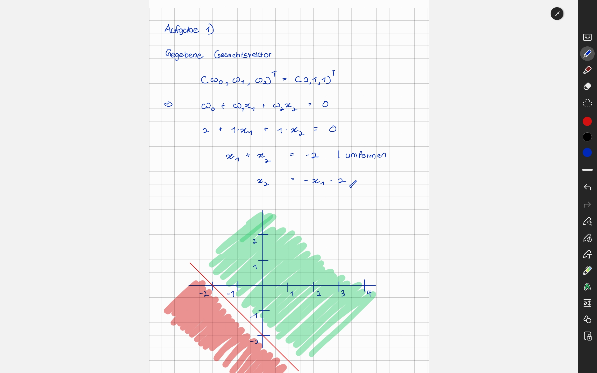
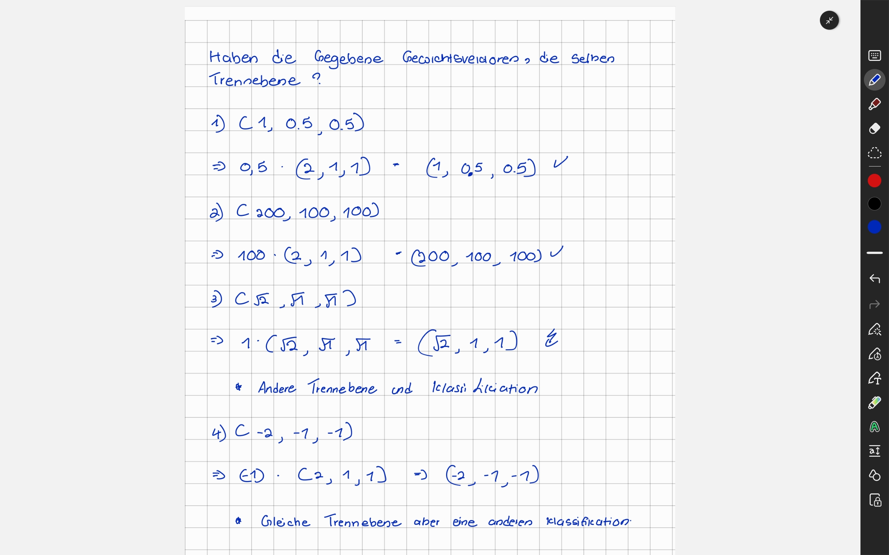

<h1>Perzeptron</h1>

Aufgabe 1.1

Aufgabe 1.2

Aufgabe 2.1

Implementierung der AND,OR und NICHT ist in den Dateien -> AndPerc.py , OrPerc.py und NotPerc.py

Aufgabe 2.2

Mit einem Perzeptron generieren wir eine gerade zwischen Werten, um diese Werte zu eine bestimme Gruppe klassifieren können. Aber, die Werte die wir von einem XOR bekommen, die kann man nicht mit
einem Trennebene trennen. Weil, die Punkte liegen Diagonal.

Aufgabe 3

Implementiert in dem Datei Aufgabe.py
